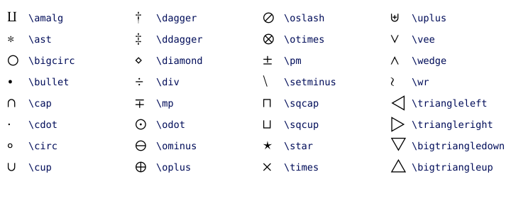
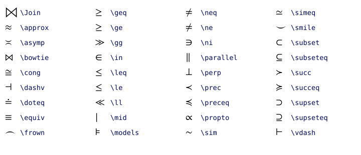
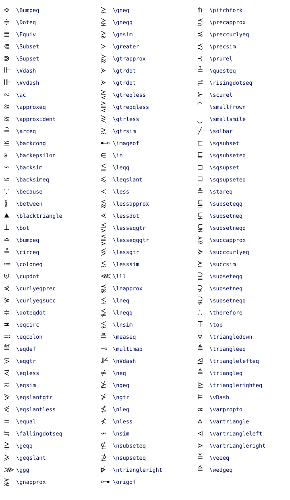

# Supported Features

*mfl* supports a significant subset of the features that a mature TeX implementation
might support. *mfl* is only concerned with the layout of mathematical formulas and
does not support other non-mathematical TeX features. This section
describes the supported features and provides examples of the results that *mfl* produces.

Note that the formulas, as seen in the examples here, are rendered using the layout
generated by *mfl*. In fact all the images showing examples here are part of the suite
of approval tests used to help test the library for regressions.

## Contents

- [Subscripts and Superscripts](#subscripts-and-superscripts)
- [Fractions](#fractions)
- [Radicals](#radicals)
- [Big Operators](#big-operators)
- [Accents](#accents)
- [Overlining and Underlining](#overlining-and-underlining)
- [Functions and User Defined Operators](#functions-and-user-defined-operators)
- [Delimiters](#delimiters)
- [Fonts](#fonts)
- [Symbols](#symbols)
    - [Greek Alphabet](#greek-alphabet)
    - [Binary Operators](#binary-operators)
    - [Relational Operators](#relational-operators)
    - [Negations](#negations)
    - [Arrows](#arrows)
    - [Punctuation](#punctuation)
    - [Others](#others)
- [Spaces](#spaces)
    

## Subscripts and Superscripts

Subscripts and superscripts including all levels of nesting are supported:

## Fractions

There is full support for the standard `\frac` command - again, including all levels of nesting:

The `\binom` command is also supported and anything that is not covered by either `\frac` or 
`\binom` can be achieved using the generalized fraction command `\genfrac`:

Note that in generalized fractions the third argument - the line thickness - is always in points and that currently 
the fourth argument - the style - is ignored and treated as if `\displaystyle` was set.

## Radicals

*mfl* has full support for radicals, including the optional degree and unlimited nesting:

## Big Operators

The standard big operators are supported in different size variants depending on the style:

The limits on big operators are placed automatically, but you can override the defaults
using the `\nolimits` and `\limits` commands:

The extended integral symbols are also considered big operators:

## Accents

There is support for the common mathematical accents:

where the wide variants of `\hat` and `\tilde` automatically adjust their size:

There is also support for some additional mathematical accents:

## Overlining and Underlining

The automatic positioning and sizing of overlines and underlines is fully supported:

## Functions and User Defined Operators

Unlike variables, known functions are typeset in roman instead of italics. *mfl* also
supports adding optional subscripted limits to some of these built-in functions:

Using the `\operatorname` command, it is possible to define custom names that then
behave like built-in functions:

## Delimiters

The following symbols are recognized as opening and closing delimiters:

The `\left` and `\right` commands provide access to automatically sized delimiters where
available, and the dot variants `\left.` and `\right.` can be used to omit one of the delimiters if necessary:

## Fonts

*mfl* only supports the scoped font switches (like `\mathrm`, `\mathit` etc.) and not the
deprecated state switches (like `\rm`, `\it` etc.). *mfl* recognises the font
commands in the examples below. Availability and appearance of glyphs will of course 
depend on the actual fonts that are being used. This is what the *Stix2* fonts look like:

## Symbols

*mfl* recognises most mathematical symbols. Here is an overview of the most important ones
for reference.

### Greek Alphabet

As per mathematical convention, Greek capitals are automatically set in roman font and 
not in italics.

### Binary Operators

*mfl* supports the basic TeX binary operators:

as well as various binary operators from additional packages like the AMS package:

### Relational Operators

Similarly to the binary operators, *mfl* supports the fundamental relational operators:

but also recognises many others:

#### Negations

Many relations can be negated by prepending `\not`:

and some further negated relational operators are also supported:

### Arrows

The TeX arrow symbols are supported:

and *mfl* will also recognise the following extended set of arrow symbols:

### Punctuation

*mfl* recognises the following symbols as punctuation:

### Others

For completeness, the following tables show the remaining supported symbols:

## Spaces

The following mathematical spacing commands are recognized by *mfl*:

